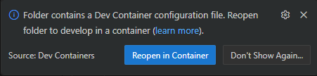

# Fancy File Server Project


The *FancyFileServer* is a **training** project designed exclusively for learning DevOps techniques and best practices. This application is **intentionally weak by design** and should never be used in production environments.

The project provides a full-stack web application built with BunJS and FastifyJS, featuring:

- **File Upload & Management**: Users can upload and manage files through a comprehensive web interface
- **Data Storage**: MongoDB with GridFS for scalable file storage
- **Caching Layer**: Redis for improved performance and session management
- **User Interface**: React SPA powered by Vite, with dedicated pages for:
  - File management
  - User administration (Admin only)
  - Statistics dashboard (Admin only)
  - JWT token generation and management
- **Authentication & Authorization**: Role-based access control with JWT tokens
- **Test Data Generation**: FakerJS for seeding fake data to the server and database in development mode
- **Comprehensive Testing**:
  - End-to-end API tests (BATS)
  - UI automation tests (Playwright)
  - Load testing (Artillery)

This project serves as a practical example for implementing CI/CD pipelines, containerization, testing strategies, and DevOps workflows.

## User Guide

Please read the [learning instructions](https://valentintwin1206.github.io/docker-js-fullstack-learning-course/).

## Development

### System Requirements

- IDE + DevContainer Integration
  - e.g. Visual Studio Code 1.106.1
  - e.g. VSCode Remote Development Extension
- Docker Desktop 4.54.0

### Setup Locally

#### Configure Environment Variables

- Rename the file `sample.env-dev` to `.env-dev`
- Open `.env-dev` and provide values as instructed in the file

#### Use DevContainer (Recommended)

- Open Visual Studio Code at the project root directory
- When prompted, click **Reopen in Container** (or use Command Palette: `Dev Containers: Reopen in Container`)

  

- Wait for the containers to build and start (this may take several minutes on first run due to Playwright browser binaries installation)
- Once ready, you'll have a fully configured development environment with all dependencies installed
- Open any Web browser and navigate to `http://127.0.0.1:5173/home`

#### Use Docker Compose

- Start the containerized services:
  
  ```bash
  docker compose --profile dev up -d
  ```

- Wait for the containers to build and start (this may take several minutes on first run due to Playwright browser binaries installation)
- Get a terminal session inside `ffs_devcontainer` container:

  ```bash
  docker exec -it ffs_devcontainer /bin/bash
  ```

- Open any Web browser and navigate to `http://127.0.0.1:5173/home`

**Note**: This runs the same DevContainer environment but without VS Code integration. All services (app, frontend, MongoDB, Redis) will start together. The React frontend runs on port `5173` (Vite dev server) and proxies API requests to the backend on port `3000`.

### Run Tests

> All tests should be executed from within the DevContainer environment. Make sure both the backend and frontend applications are running before executing tests.

Start the applications in two separate terminals:

```bash
# Terminal 1 — Backend (port 3000)
cd backend && bun run start:dev

# Terminal 2 — Frontend (port 5173)
cd frontend && bun run dev
```

#### End-to-End API Tests (BATS)

Test the REST API endpoints using BATS (Bash Automated Testing System):

```bash
bun run test:api
```

#### UI Tests (Playwright)

Test the web interface with Playwright browser automation:

```bash
bun run test:gui
```

#### Load Tests (Artillery)

Run performance and load tests to simulate traffic:

##### Smoke Tests - Quick validation with minimal load

```bash
bun run test:load:smoke:api  # API smoke test
bun run test:load:smoke:gui  # UI smoke test
```

##### Spike Tests - Test sudden traffic spikes

```bash
bun run test:load:spike:api  # API spike test
bun run test:load:spike:gui  # UI spike test
```

##### Soak Tests - Long-duration tests for stability

```bash
bun run test:load:soak:api  # API soak test
bun run test:load:soak:gui  # UI soak test
```

## Build With GitHub

### Pre-Release

- Navigate to **Actions** → **Manual Dispatch** in the GitHub repository
- Click **Run workflow**
- Enter a custom tag (e.g., `dev`, `beta`, `rc1`)
- Optionally enable **Upload Docker image to registry** if you want to push to Docker Hub
- Click **Run workflow** to start the build and test pipeline

### Release

- Create a new release in the GitHub repository
- Tag the release with semantic versioning (e.g., `v1.0.0`, `v2.1.3`)
- Publish the release
- The **On Release** workflow automatically triggers, runs all tests, and pushes the Docker image to Docker Hub with the release tag
